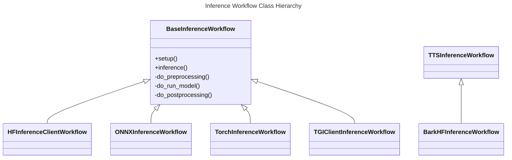

# Architecture

The `infernet-ml` library comes with two classes of workflows:

1. Inference Workflows
2. Fine-tuning Workflows (Coming Soon)

## Inference Workflows

Inference workflows all subclass
the [`BaseInferenceWorkflow`](../reference/infernet_ml/workflows/inference/base_inference_workflow/)
class.
Just like we did in our [Quickstart](../quickstart) section earlier,
to run an inference workflow, you need to:

1. Instantiate the workflow class
2. Call the `setup()` method to prepare the workflow for running
3. Call the `inference()` method to execute the workflow
4. Call the `stream()` method to stream the output to the user (for streaming workflows)

### Life-Cycle of an Inference Workflow

All workflows implement the following life-cycle methods:

#### `do_setup(self) -> Any`

This method is called by the `setup` method. It is used to prepare the workflow for
running. This method is called only
once during the life-cycle of the workflow. It is used to perform any setup operations
that are required before the
workflow can be run. For workflows that run the model themselves, this is where the model
is downloaded, and any
ahead-of-time verifications are performed.

#### `do_preprocessing(self, input_data: Any) -> Any`

This method is the first method called by the `inference` method. It is used to perform
any preprocessing operations on
the input data before it is passed to the model. The output of this method is passed to
the `do_inference` method.

#### `def do_run_model(self, preprocessed_data: Any) -> Any`

This method is called by the `inference` method after the `do_preprocessing` method. This
is where the model is run on
the preprocessed data. The output of this method is passed to the `do_postprocessing`
method.

#### `do_postprocessing(self, input_data: Any, output_data: Any) -> Any`

This method is called by the `inference` method after the `do_run_model` method. It is
used to perform any postprocessing
operations on the output data before it is returned to the user. The output of this
method is returned to the user.

### Life-Cycle of an Streaming Inference Workflow

Much like non-streaming workflows, streaming workflows implement the same life-cycle
methods. However,all of the hooks are brought together & called by the `stream()`
method.

#### `do_setup(self) -> Any`

Same as above, this method is called by the `setup` method. It is used to prepare the
workflow for running.

#### `do_preprocessing(self, input_data: Any) -> Any`

This is the first method called by the `stream` method. It is used to perform any
preprocessing operations on
the input data before it is passed to the model. The output of this method is passed
to the `do_stream` method.

#### `do_stream(self, preprocessed_data: Any) -> Iterator[Any]`

This method is called by the `stream` method after the `do_preprocessing` method. This is
where the model is run on
the preprocessed data. The output of this method is directly fed to the user.

### Class Hierarchy

### Available Inference Workflows

The following inference workflows are available in the `infernet-ml` library:

1. [`HFInferenceClientWorkflow`](./reference/infernet_ml/workflows/inference/hf_inference_client_workflow.md):
   This worflow
   uses the
   Huggingface [Inference Client library](https://huggingface.co/docs/huggingface_hub/en/package_reference/inference_client)
   to run all models that are hosted on Huggingface.
2. [`ONNXInferenceWorkflow`](./reference/infernet_ml/workflows/inference/onnx_inference_workflow.md):
   This workflow is used
   to run models that are in the ONNX format.
3. [`TorchInferenceWorkflow`](./reference/infernet_ml/workflows/inference/torch_inference_workflow.md):
   This workflow is used
   to run models that are in the PyTorch format.
4. [`CSSInferenceWorkflow`](./reference/infernet_ml/workflows/inference/css_inference_workflow.md):
   This workflow is used to
   run closed-source models: i.e. OpenAI's `GPT-4`, etc.
5. [`TGIClientInferenceWorkflow`](./reference/infernet_ml/workflows/inference/tgi_client_inference_workflow.md):
   This workflow is used to run models that are hosted on
   a [Huggingface's Text Generation Interface](https://huggingface.co/docs/text-generation-inference/en/index)
   server.
6. [`BarkHFInferenceWorkflow`](./reference/infernet_ml/workflows/inference/bark_hf_inference_workflow.md):
   This workflow is used to run Suno's Bark model.
